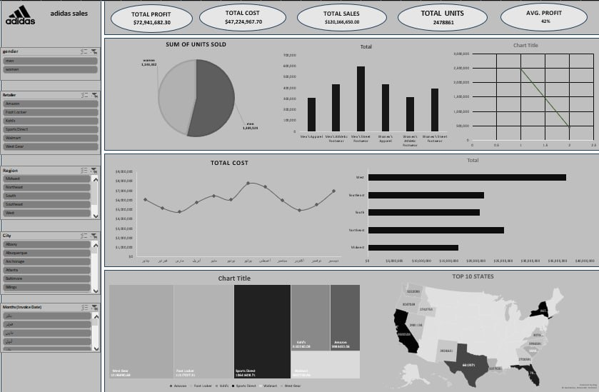

# 👟 Adidas Sales Dashboard

## 📌 Project Overview

This project analyzes Adidas sales data to understand business performance, profitability, sales trends, and product performance.

The dashboard provides interactive insights about total sales, total profit, costs, units sold, retailer performance, regional analysis, and product categories.

---

## 📊 Dashboard Preview

---

## 🎯 Objectives

- Analyze Adidas sales performance
- Track total sales, profit, and cost
- Identify top performing retailers and regions
- Analyze product category performance
- Understand sales and cost trends over time
- Compare units sold across different categories

---

## 🛠 Tools Used

- Microsoft Excel
- Pivot Tables
- Data Cleaning
- Data Visualization
- Dashboard Design

---

## 📈 Key Insights

- Total Sales reached **$160M+**
- Total Profit reached **$72M+**
- Total Units Sold exceeded **2.4M units**
- Retailer performance varies across different regions
- Some product categories contribute more to overall sales volume
- Regional analysis highlights top performing states
- Sales and cost trends change over different months

---

## 🔍 Dashboard Features

### KPIs:
- Total Profit
- Total Cost
- Total Sales
- Total Units
- Average Profit

### Filters:
- Gender
- Retailer
- Region
- City
- Month

### Visualizations:
- Units Sold Analysis
- Sales by Product Category
- Cost Trend Analysis
- Retailer Performance
- Top States Map
- Product Distribution
